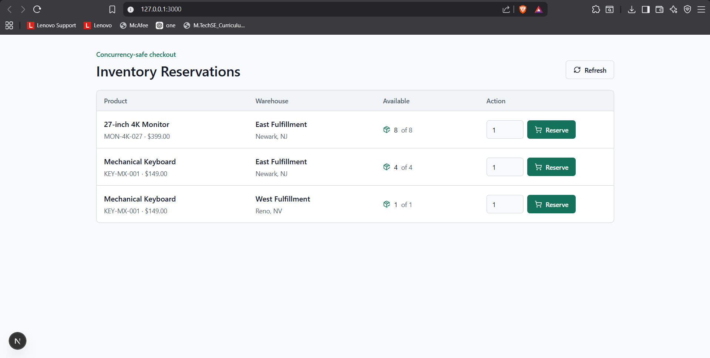
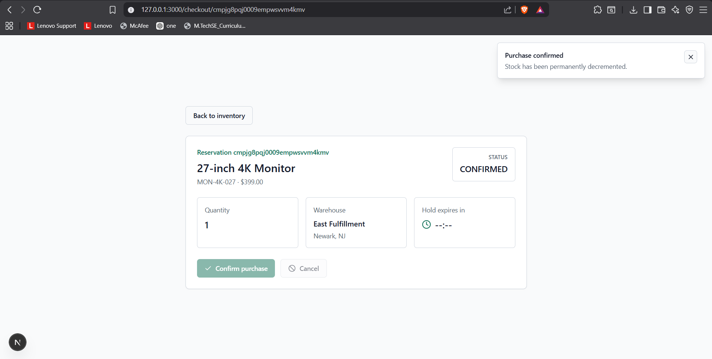
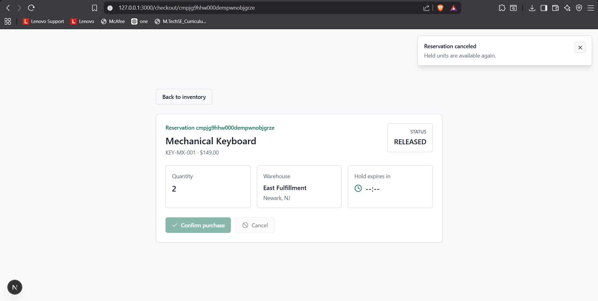
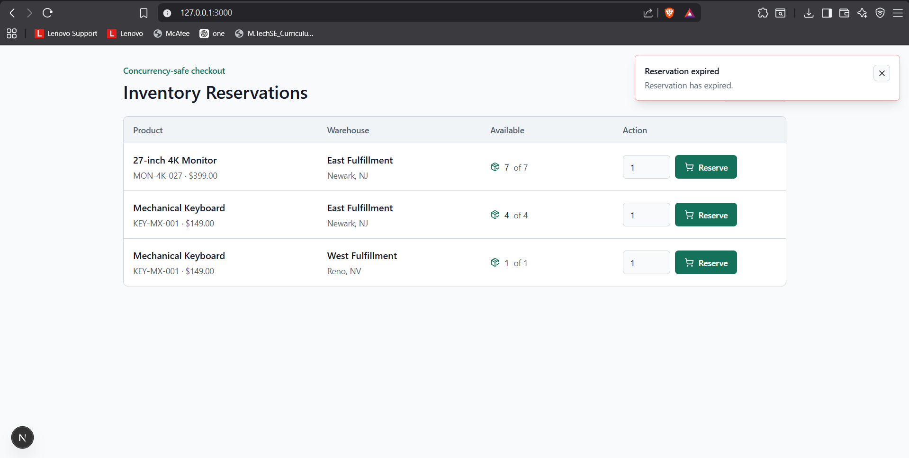
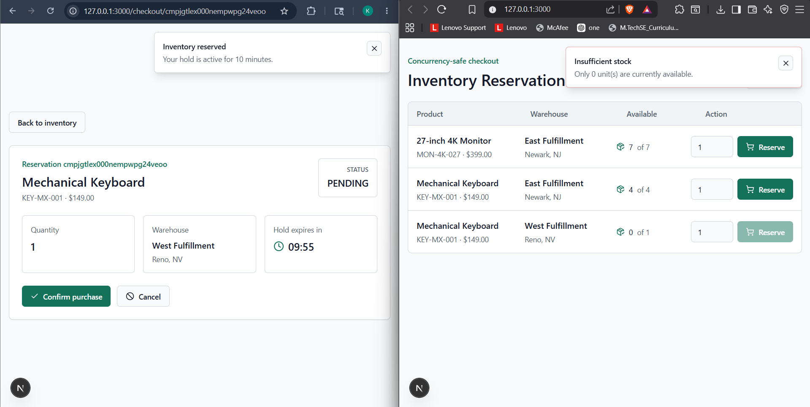

# Inventory Reservation System

An end-to-end inventory and order-fulfillment reservation system built to prevent checkout overselling under high concurrency.

The core guarantee is simple: when multiple users try to reserve the final unit of a SKU at the same time, exactly one request succeeds and the others receive `409 Conflict`.

## Tech Stack

- Next.js App Router
- TypeScript strict mode
- PostgreSQL with Prisma ORM
- Redis with Upstash for idempotency
- Zod for API validation
- Tailwind CSS with shadcn-style UI primitives

## Features

- Product listing with per-warehouse available stock
- 10-minute reservation hold during checkout
- Live countdown timer on the checkout page
- Confirm purchase flow
- Cancel/release reservation flow
- Expired reservation handling
- Database-level row locking using `SELECT ... FOR UPDATE`
- Redis-backed idempotency for reserve and confirm endpoints
- Secured cleanup cron endpoint for expired pending reservations

## Screenshots

### Product Listing



### Reservation Confirmed



### Reservation Cancelled



### Expired Reservation



### Concurrency Control



## Data Model

The Prisma schema is defined in [`prisma/schema.prisma`](prisma/schema.prisma).

Main entities:

- `Warehouse`: fulfillment location
- `Product`: purchasable SKU
- `Stock`: product inventory per warehouse
- `Reservation`: expiring hold with `PENDING`, `CONFIRMED`, or `RELEASED` status

`Stock` has a compound unique index on `[productId, warehouseId]`, ensuring one inventory row per product and warehouse pair.

## Concurrency Strategy

The critical reservation logic lives in [`src/server/reservations.ts`](src/server/reservations.ts).

When a reservation is created, the app opens a Prisma transaction and locks the exact `Stock` row:

```sql
SELECT id, "productId", "warehouseId", "totalUnits", "reservedUnits"
FROM "Stock"
WHERE "productId" = $1 AND "warehouseId" = $2
FOR UPDATE
```

While the row is locked, the service checks:

```text
availableUnits = totalUnits - reservedUnits
```

If enough units are available, it increments `reservedUnits` and creates a `PENDING` reservation in the same transaction. If not, the transaction returns `409 Conflict`.

Because the availability check and counter update happen while holding a database row lock, concurrent requests for the same product and warehouse are serialized by PostgreSQL.

## Reservation Lifecycle

1. Reserve stock:
   - Creates a `PENDING` reservation.
   - Increments `Stock.reservedUnits`.
   - Sets `expiresAt` to 10 minutes in the future.

2. Confirm purchase:
   - Marks reservation as `CONFIRMED`.
   - Decrements `Stock.totalUnits`.
   - Decrements `Stock.reservedUnits`.

3. Cancel or release:
   - Marks reservation as `RELEASED`.
   - Decrements `Stock.reservedUnits`.

4. Expiry:
   - Expired pending reservations are ignored on product reads.
   - Cleanup cron marks expired reservations as `RELEASED` and releases reserved units.

## API Endpoints

| Method | Endpoint | Description |
| --- | --- | --- |
| `GET` | `/api/products` | List products with available stock per warehouse |
| `GET` | `/api/warehouses` | List warehouses |
| `POST` | `/api/reservations` | Create a 10-minute stock reservation |
| `GET` | `/api/reservations/:id` | Fetch reservation details |
| `POST` | `/api/reservations/:id/confirm` | Confirm purchase |
| `POST` | `/api/reservations/:id/release` | Cancel/release reservation |
| `POST` | `/api/cron/cleanup-reservations` | Release expired pending reservations |

## Idempotency

`POST /api/reservations` and `POST /api/reservations/:id/confirm` support the `Idempotency-Key` header.

The wrapper in [`src/lib/idempotency.ts`](src/lib/idempotency.ts) stores the exact HTTP response body and status in Upstash Redis for 24 hours. If the same key is sent again, the API returns the cached response immediately and bypasses database mutation logic.

## Expiry Strategy

The app uses a dual expiry strategy:

- Lazy read cleanup: `GET /api/products` calculates available stock from active, non-expired pending reservations.
- Background cleanup: `/api/cron/cleanup-reservations` releases expired pending reservations and decrements `reservedUnits`.

The cron endpoint is protected by:

```text
Authorization: Bearer $CRON_SECRET
```

## Local Setup

Install dependencies:

```bash
npm install
```

Create `.env` from the example:

```bash
cp .env.example .env
```

Required environment variables:

```env
DATABASE_URL="postgresql://..."
DIRECT_URL="postgresql://..."
UPSTASH_REDIS_REST_URL="..."
UPSTASH_REDIS_REST_TOKEN="..."
CRON_SECRET="replace-with-a-long-random-secret"
```

For Neon, `DATABASE_URL` can point to the pooled URL and `DIRECT_URL` should point to the direct host. Prisma schema sync may fail if `channel_binding=require` is present, so use `sslmode=require`.

Sync the database and seed sample data:

```bash
npx prisma db push
npm run prisma:seed
```

Start the app:

```bash
npm run dev -- -H 127.0.0.1
```

Open:

```text
http://127.0.0.1:3000
```

## Verification

The following checks were run successfully:

```bash
npx prisma db push
npm run prisma:seed
npx tsc --noEmit
npm run build
```

## Project Structure

```text
prisma/schema.prisma                 Database schema
prisma/seed.ts                       Sample product, warehouse, and stock seed data
src/server/reservations.ts           Concurrency-safe reservation service
src/lib/idempotency.ts               Redis idempotency wrapper
src/app/api                          Next.js route handlers
src/components/product-list.tsx      Product listing UI
src/components/checkout-client.tsx   Checkout countdown and actions
Outputs/                             Submission screenshots
```
